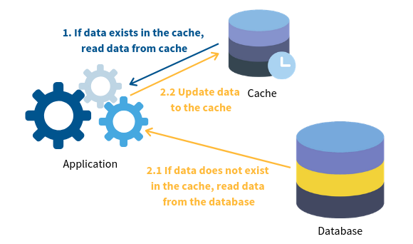
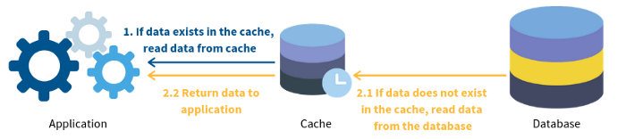
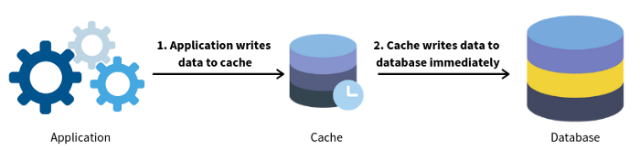
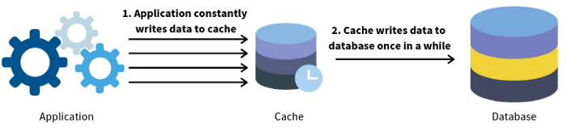
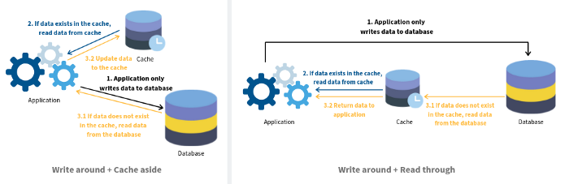

# Cách chiến lược đọc cache
## 1. Cache aside (Hay được dùng)

## 2. Read through

## 3. Write through

## 4. Redis vector library

## 5. Redis vector library

# Setup REDIS ở local

## 1. Download redis docker image

`docker run -d --name redis-stack -p 6379:6379 -p 8001:8001 redis/redis-stack:latest`

Trong đó:
- port 6379: port Redis server
- port 8001: port RedisInsight Web UI 

## 2. Thao tác với redis-cli

`docker exac -it redis-stack redis-cli`

Nhập thử các lệnh cơ bản sau:
- `set name Quang`
- `get name`
- `set age 22`
- `get age`
- `keys *`
- `unlink age`
- `del name`
- `get name`
- `set address TB`
- `expire address 10`
- `exists address` (sau 10 giây)

## 3. Redis trên python
- Install `pip install redis`
- Thao tác với redis trên python
    - `r = Redis(host='localhost', port=6379)`
    - SET: `r.set(name='key', value='value',ex=ttl)`
    - DELETE: `r.delete('key')`
    - SET HASH: `r.hset('key:1', 'key', 'value')`
    - SET LIST: `r.rpush('key', 'value1', 'value2')`

## 4. Setup Redis

File redis_local.py

# Setup REDIS với Azure Cache Redis
__Link:__ https://learn.microsoft.com/en-us/azure/redis/python-get-started?tabs=entraid&pivots=azure-managed-redis

Cách tạo và Azure Redis Cache và kết nối với cloud Redis của Azure

# Local Redis vs Cloud Redis
- Khác cách kết nối với Redis server
- Khác về deploy
- Các cách thao tác với Redis Database như add, delete, ... giống nhau vì cùng dùng thư viện redis trên python để thao tác

# Redis cho RAG
__Link:__ https://redis.io/docs/latest/develop/get-started/rag/

Vai trò của Redis:
- Vector database: lưu trữ và index vector embedding
- Semantic cache: cache những câu hỏi thường được hỏi trong RAG
- LLM session manager: lưu trữ conversation

## Vector Database

## RedisVL (Redis vector library)
Thư viên cung cấp API để làm việc với vector trong Redis
